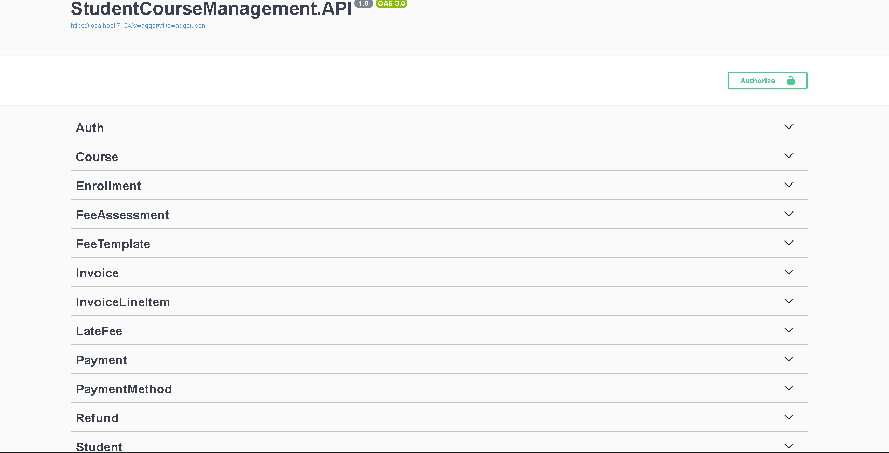
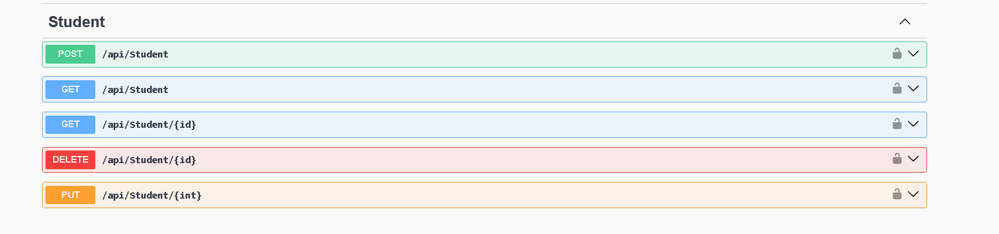
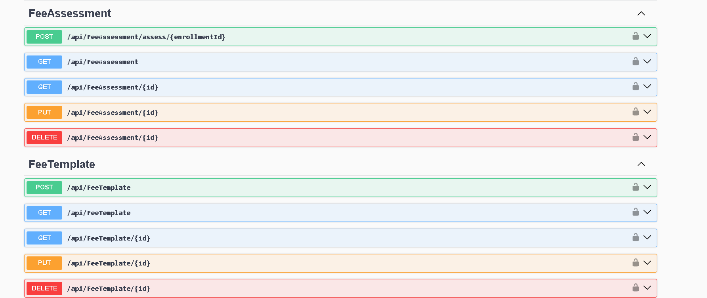
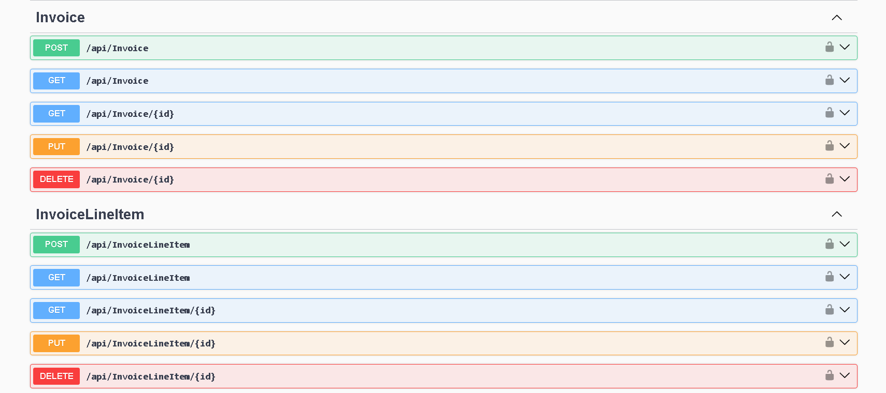
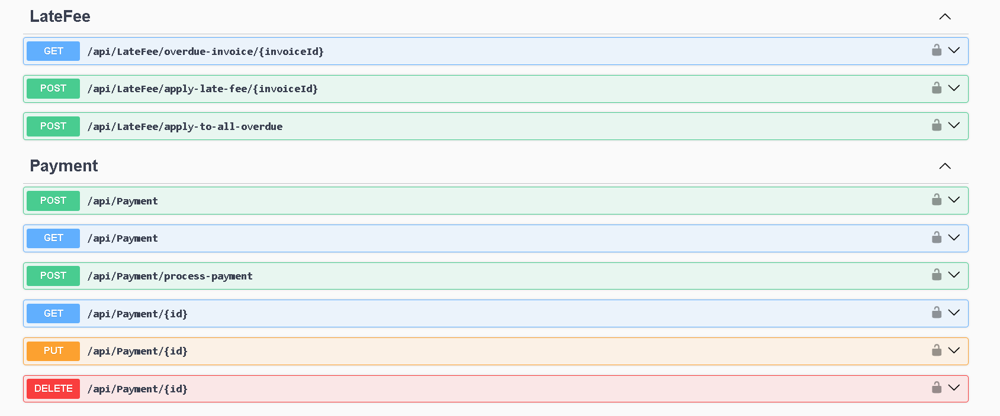
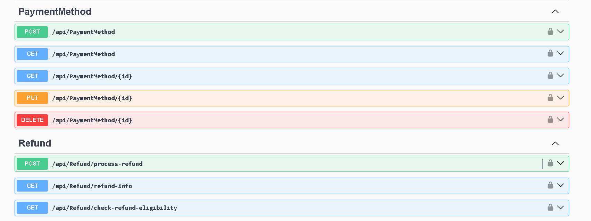
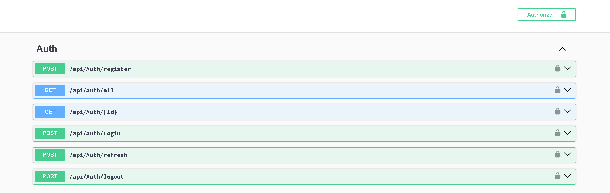

# 🎓 Student Course Management & Financial System API

ASP.NET Core 9 | Dapper | SQL Server | JWT Authentication | Layered Architecture


A production-ready REST API for managing students, courses, enrollments, and a complete automated financial cycle including fee assessment, invoices, payments, refunds, and late fee processing.

---

## Table of Contents

- [Overview](#overview)
- [Technologies](#technologies)
- [Architecture & Layers](#architecture-layers)
- [Core Features](#core-features)
- [Project Structure](#project-structure)
- [API Documentation (Swagger)](#api-documentation-swagger)
- [Setup & Installation](#setup-installation)
- [Testing](#testing)
- [Security & Configuration](#security-configuration)
- [License](#license)

---

<a id="overview"></a>
## Overview

This backend system is designed for educational institutions and includes:

- Student & course management (CRUD + filtering + pagination)
- Rule-based enrollment system with business validations
- Automated financial module:
  - Fee templates (flat / per credit)
  - Automatic invoice generation
  - Payment processing (supports partial payments)
  - Refund validation & processing
  - Late fee automation (10% penalty logic)

---

<a id="technologies"></a>
## Technologies

| Category            | Technology                              | Version |
|---------------------|------------------------------------------|---------|
| Framework           | ASP.NET Core Web API                   | .NET 9 |
| Data Access         | Dapper                                  | 2.x     |
| ORM (optional)      | EF Core (for migrations)               | 9.x     |
| Authentication      | JWT Bearer                              | 9.x     |
| Password Hashing    | BCrypt.Net-Next                         | 4.x     |
| Object Mapping      | AutoMapper                              | 12.x    |
| API Documentation   | Swashbuckle.AspNetCore (Swagger)        | 6.x+    |
| Testing             | MSTest                                  | Latest  |
| Database            | SQL Server                              | 2019+   |

---

<a id="architecture-layers"></a>
## Architecture & Layers

Clean layered architecture:

```text
StudentCourseManagement (Solution)
├── src
│   ├── StudentCourseManagement.Domain
│   ├── StudentCourseManagement.Data
│   ├── StudentCourseManagement.Business
│   └── StudentCourseManagement.API
└── Tests
    ├── StudentCourseManagement.Tests.Unit
    ├── StudentCourseManagement.Tests.Integration
    ├── StudentCourseManagement.Tests.Api
    └── StudentCourseManagement.Tests.Common
```

### Layer Responsibilities

- **Domain** → Entities, enums, domain rules, exceptions
- **Data** → Dapper repositories & SQL queries
- **Business** → Services & business logic
- **API** → Controllers, DTOs, Middleware, Program.cs
- **Tests** → Unit, integration & API tests

---

<a id="core-features"></a>
## Core Features

- Student CRUD with soft delete
- Course management with capacity control
- Enrollment validation rules
- Automatic fee assessment
- Invoice creation with line items
- Atomic payment processing
- Refund eligibility validation
- Late fee batch processing (10%)

---

<a id="project-structure"></a>
## Project Structure

```text
StudentCourseManagement
├── src
│   ├── StudentCourseManagement.API
│   ├── StudentCourseManagement.Business
│   ├── StudentCourseManagement.Data
│   └── StudentCourseManagement.Domain
└── Tests
    ├── StudentCourseManagement.Tests.Api
    ├── StudentCourseManagement.Tests.Common
    ├── StudentCourseManagement.Tests.Integration
    └── StudentCourseManagement.Tests.Unit
```

---

<a id="api-documentation-swagger"></a>
## API Documentation (Swagger)

### 🔹 Swagger Overview


### 🔹 Student Endpoints


### 🔹 Financial Endpoints





### 🔹 JWT Authentication


---

<a id="setup-installation"></a>
## Setup & Installation

### 1️⃣ Clone Repository

```bash
git clone https://github.com/pawan-pathak12/StudentCourseManagementSystem.git
cd StudentCourseManagement
```

### 2️⃣ Restore Packages

```bash
dotnet restore
```

### 3️⃣ Configure Database & JWT

Update:

`src/StudentCourseManagement.API/appsettings.json`

```json
{
  "ConnectionStrings": {
    "DefaultConnection": "Server=localhost;Database=StudentCourseDb;Trusted_Connection=True;TrustServerCertificate=True;"
  },
  "Jwt": {
    "Key": "your-very-long-random-secret-key-minimum-32-characters"
  }
}
```

### 4️⃣ Create Database

Use provided SQL scripts  
OR apply EF Core migrations if configured.

### 5️⃣ Run the API

```bash
dotnet run --project src/StudentCourseManagement.API
```

Swagger should open at:

```text
https://localhost:<7104>/swagger
```

---

<a id="testing"></a>
## Testing

Run all tests:

```bash
dotnet test
```

Run specific test categories:

```bash
# Unit tests
dotnet test --filter FullyQualifiedName~Tests.Unit

# Integration tests
dotnet test --filter FullyQualifiedName~Tests.Integration

# API tests
dotnet test --filter FullyQualifiedName~Tests.Api
```

---

<a id="security-configuration"></a>
## Security & Configuration

- JWT Bearer authentication
- BCrypt password hashing
- Parameterized Dapper queries (SQL injection safe)
- Transaction handling for financial consistency
- HTTPS required in production
- Store secrets using User Secrets / Azure Key Vault

---

<a id="license"></a>
## License

MIT License  
See the LICENSE file for details.

---
